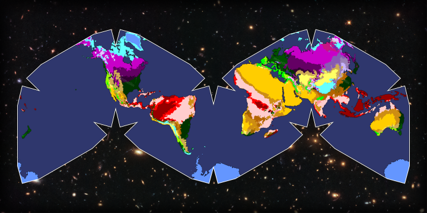

# cahill-keyes-koppen
This repo contains most of the work that went into generating my [Cahill–Keyes projection](https://en.wikipedia.org/wiki/Cahill%E2%80%93Keyes_projection) of the world's [Köppen climate classification](https://en.wikipedia.org/wiki/K%C3%B6ppen_climate_classification) data. Since all of the packages that I used provide CLI commands, the most important part of this repo is the `generate.sh` shell script that executes those commands; however, I did include a `package.json` file so that anyone can just clone this repo and run `npm install`.

## Installation and usage
Before installation, make sure that you have Node.js/npm installed. To install this package and its dependencies, enter a directory of your choice and run:  
```
git clone https://github.com/mmatlin/cahill-keyes-koppen.git
cd cahill-keyes-koppen
npm install
```
To generate the output SVG, run:  
```
npm run generate
```
This will generate an SVG file that does not look like my final version of the projection, but like only ocean. To deal with that, I had to determine what was what in the generated SVG using Adobe Illustrator, then fix the paths that were generated. In particular, all paths are created as compound paths for some reason, so I released all of these and deleted all ocean-shaped paths except for one, which stayed as the ocean. After this, all of the non-ocean-shaped paths are visible and colored as specified by `koppen_gridcodes.json` (which needs adjusting—I was not very concerned with the color palette when I did this project since it was more of a proof of concept and ended up using an existing list of colors).

Any further edits I made (background image, ocean shading) were not out of necessity but to make it look nicer.



I will determine the best way to provide the full image a bit later on (I exported it at a solid 14401×7201). I am slightly wary of the image being posted elsewhere without attribution :) (and I may just put it here sometime anyway)

## So why the Cahill–Keyes projection?
[The Cahill–Keyes projection](https://en.wikipedia.org/wiki/Cahill%E2%80%93Keyes_projection) is nearly conformal and equal-area, and is a great compromise projection, especially given that its edges intersect few landmasses. It's also just an interesting and relatively rare projection to encounter, and I wanted to try putting the world's [Köppen climate classification](https://en.wikipedia.org/wiki/K%C3%B6ppen_climate_classification) data onto it (combining two well-made systems of deliberate design).

## Future plans
Maybe write an Inkscape extension that processes the output SVG into the finished projection, although Inkscape extension development documentation is poor. I may also add a legend for the climate classification codes in the finished projection.

## Data sources
The Köppen climate classification data comes from the [Unit of Veterinary Public Health and Epidemiology at the University of Veterinary Medicine Vienna](https://www.vetmeduni.ac.at/en/institute-of-veterinary-public-health/). Specifically, the data is available on the page about [Observed and Projected Climate Shifts 1901-2100
Depicted by World Maps of the Köppen-Geiger Climate Classification](http://koeppen-geiger.vu-wien.ac.at/shifts.htm). Here is a direct link to the dataset used: [1976-2000_GIS.zip](http://koeppen-geiger.vu-wien.ac.at/data/1976-2000_GIS.zip). The color palette I used was created by [@jsanz](https://github.com/jsanz) and is available at [this Gist](https://gist.github.com/jsanz/5766a587113d092739b6)—the only changes that I made were to convert it from CSV to JSON and remove the classification code data. The original gridcode mapping appears to also come from the Unit of Veterinary Public Health and Epidemiology at [this link](http://koeppen-geiger.vu-wien.ac.at/data/legend.txt).

The background image used is ["A gargantuan collision"](https://esahubble.org/images/potw1802a/) from [ESA/Hubble](https://esahubble.org/) & NASA, [RELICS](https://archive.stsci.edu/prepds/relics/).
